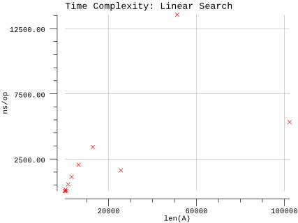

# Better Linear Search

## Pseudocode

**Procedure:** `BetterLinearSearch(A, n, x)`

**Inputs:**

* `A`: an array
* `n`: the number of elements in A to search through
* `x`: the value being searched for

**Output:** Either an index `i` for which `A[i] = x`, or the special value `NOT-FOUND`, which could be any invalid index into the array, such as `0` or any negative integer.

**Implementation:**

1. For each index `i`, going from `1` to `n`, in order:
   1. If `A[i] = x`, then return the value of `i`.
2. Return `NOT-FOUND`.

## Implementation

* Instead of a magic number, we take advantage of Go's multiple return types and use a boolean to indicate whether the result was found.
* Arrays are zero indexed in Go so we adjust the loop accordingly.
* We infer `n` based on the length of `A`.

## Results

**Benchmark:**


```plain
$ go test -run=X -bench=Linear -benchmem
goos: darwin
goarch: amd64
pkg: github.com/billglover/au/algorithms/better-linear-search
BenchmarkLinearSearch_100-4             30000000                44.1 ns/op             0 B/op          0 allocs/op
BenchmarkLinearSearch_200-4             20000000                55.0 ns/op             0 B/op          0 allocs/op
BenchmarkLinearSearch_400-4             10000000               163 ns/op               0 B/op          0 allocs/op
BenchmarkLinearSearch_800-4             20000000                56.9 ns/op             0 B/op          0 allocs/op
BenchmarkLinearSearch_1600-4            10000000               557 ns/op               0 B/op          0 allocs/op
BenchmarkLinearSearch_3200-4            10000000              1131 ns/op               0 B/op          0 allocs/op
BenchmarkLinearSearch_6400-4              500000              2062 ns/op               0 B/op          0 allocs/op
BenchmarkLinearSearch_12800-4             300000              3427 ns/op               0 B/op          0 allocs/op
BenchmarkLinearSearch_25600-4            1000000              1635 ns/op               0 B/op          0 allocs/op
BenchmarkLinearSearch_51200-4             500000             13563 ns/op               0 B/op          0 allocs/op
BenchmarkLinearSearch_102400-4            300000              5330 ns/op               0 B/op          0 allocs/op
PASS
ok      github.com/billglover/au/algorithms/better-linear-search        36.568s
```

**Complexity:**



As this graph shows, we can't predict the actual run time of the Better Linear Search. We can say that it's worst case run time is equivalent to that of Linear Search, however in most cases the run time should be better than that because we return as soon as the result is found. This is evident from the results shown above.