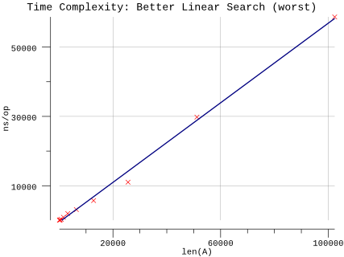
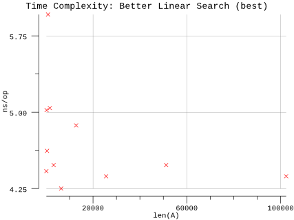
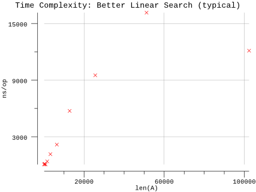

# Better Linear Search

## Pseudocode

**Procedure:** `BetterLinearSearch(A, n, x)`

**Inputs:**

* `A`: an array
* `n`: the number of elements in A to search through
* `x`: the value being searched for

**Output:** Either an index `i` for which `A[i] = x`, or the special value `NOT-FOUND`, which could be any invalid index into the array, such as `0` or any negative integer.

**Implementation:**

1. For each index `i`, going from `1` to `n`, in order:
   1. If `A[i] = x`, then return the value of `i`.
2. Return `NOT-FOUND`.

## Implementation

* Instead of a magic number, we take advantage of Go's multiple return types and use a boolean to indicate whether the result was found.
* Arrays are zero indexed in Go so we adjust the loop accordingly.
* We infer `n` based on the length of `A`.

## Results

**Benchmark:**

```plain
$ go test -run=X -bench=Linear -benchmem
goos: darwin
goarch: amd64
pkg: github.com/billglover/au/algorithms/better-linear-search
BenchmarkLinearSearch_100-4             20000000                61.3 ns/op             0 B/op          0 allocs/op
BenchmarkLinearSearch_200-4             20000000                97.1 ns/op             0 B/op          0 allocs/op
BenchmarkLinearSearch_400-4             10000000               167 ns/op               0 B/op          0 allocs/op
BenchmarkLinearSearch_800-4              5000000               306 ns/op               0 B/op          0 allocs/op
BenchmarkLinearSearch_1600-4             2000000               914 ns/op               0 B/op          0 allocs/op
BenchmarkLinearSearch_3200-4             1000000              1983 ns/op               0 B/op          0 allocs/op
BenchmarkLinearSearch_6400-4              500000              3132 ns/op               0 B/op          0 allocs/op
BenchmarkLinearSearch_12800-4             200000              5727 ns/op               0 B/op          0 allocs/op
BenchmarkLinearSearch_25600-4             100000             11030 ns/op               0 B/op          0 allocs/op
BenchmarkLinearSearch_51200-4              50000             29792 ns/op               0 B/op          0 allocs/op
BenchmarkLinearSearch_102400-4             20000             58687 ns/op               0 B/op          0 allocs/op
PASS
ok      github.com/billglover/au/algorithms/better-linear-search        20.220s
```

**Complexity:**

| Running Time | Complexity |
|--------------|------------|
| Worst        | Θ(n)       |
| Best         | Θ(1)       |
| Typical      | Θ(n)       |

Worst case performance of the algorithm requires searching the full array. In this case we are searching for a value we know does not exist.



For comparison the best case performance of the algorithm doesn't vary with the array size. This is because the algorithm returns as soon as the value is found.



With typical run-times, we see variable performance as it is rare that we end up searching the full array for the value in question. Unlike [Linear Search](algorithms/linear-search/), we return as soon as we have found the value we are looking for.


