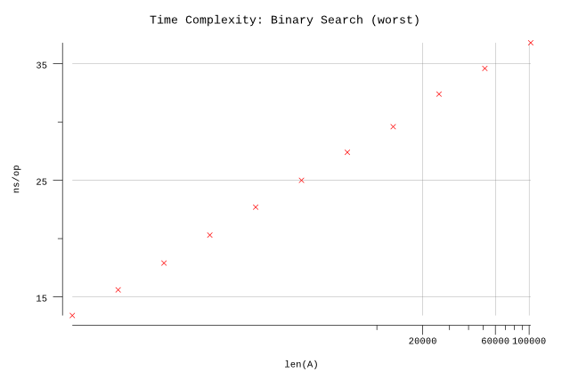
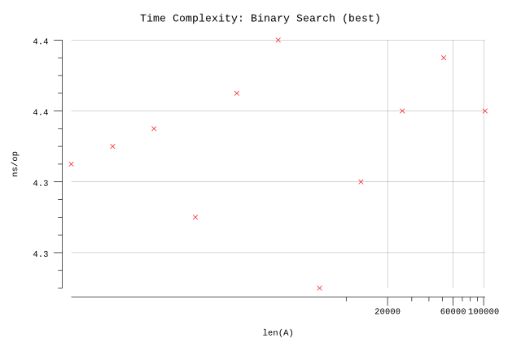
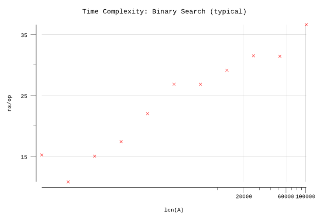

# Linear Search

## Pseudocode

**Procedure:** `BinarySearch(A, n, x)`

**Inputs:**

* `A`: an array
* `n`: the number of elements in A to search through
* `x`: the value being searched for

**Output:** Either an index `i` for which `A[i] = x`, or the special value `NOT-FOUND`, which could be any invalid index into the array, such as `0` or any negative integer.

**Implementation:**

1. Set `p` to `1`, and set `r` to `n`.
2. While `p <= r`, do the following:
   1. Set `q` to `⌊(p+r) / 2⌋`.
   2. If `A[q] == x` then return `q`.
   3. Otherwise (`A[q] != x`), if `A[q] > x`, then set `r` to `q-1`.
   4. Otherwise (`A[q] < x`), set `p` to `q+1`.
3. Return `Not-Found`.

## Implementation

* Instead of a magic number, we take advantage of Go's multiple return types and use a boolean to indicate whether the result was found.
* Arrays are zero indexed in Go so we adjust the loop accordingly.
* We infer `n` based on the length of `A`.

## Results

**Benchmark:**

```plain
$ go test -run=X -bench=. -benchmem
goos: darwin
goarch: amd64
pkg: github.com/billglover/au/algorithms/binary-search
BenchmarkBinarySearch_100-4             100000000               14.1 ns/op             0 B/op          0 allocs/op
BenchmarkBinarySearch_200-4             100000000               17.0 ns/op             0 B/op          0 allocs/op
BenchmarkBinarySearch_400-4             100000000               20.2 ns/op             0 B/op          0 allocs/op
BenchmarkBinarySearch_800-4             50000000                21.3 ns/op             0 B/op          0 allocs/op
BenchmarkBinarySearch_1600-4            50000000                22.7 ns/op             0 B/op          0 allocs/op
BenchmarkBinarySearch_3200-4            50000000                25.0 ns/op             0 B/op          0 allocs/op
BenchmarkBinarySearch_6400-4            50000000                27.2 ns/op             0 B/op          0 allocs/op
BenchmarkBinarySearch_12800-4           50000000                29.8 ns/op             0 B/op          0 allocs/op
BenchmarkBinarySearch_25600-4           50000000                32.1 ns/op             0 B/op          0 allocs/op
BenchmarkBinarySearch_51200-4           50000000                34.4 ns/op             0 B/op          0 allocs/op
BenchmarkBinarySearch_102400-4          50000000                36.8 ns/op             0 B/op          0 allocs/op
PASS
ok      github.com/billglover/au/algorithms/binary-search       16.996s
```

**Complexity:**

| Bounds | Complexity |
|--------|------------|
| Worst  | Θ(lg n)       |
| Best   | Θ(1)       |
| All    | O(n)       |

Worst case performance of the algorithm requires searching the full array, but we take advantage of the fact that the array is sorted to achieve Θ(ln n) in the time domain.



With the Binary Search algorithm the best case performance of the algorithm is when the item we are looking for is in the middle of the array.



The typical case lies between the best and worst case bounds.


