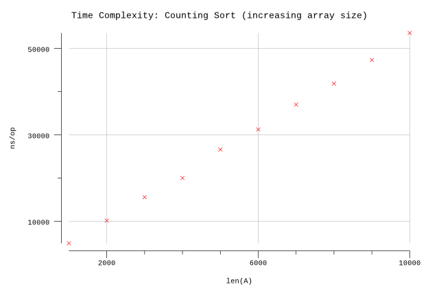
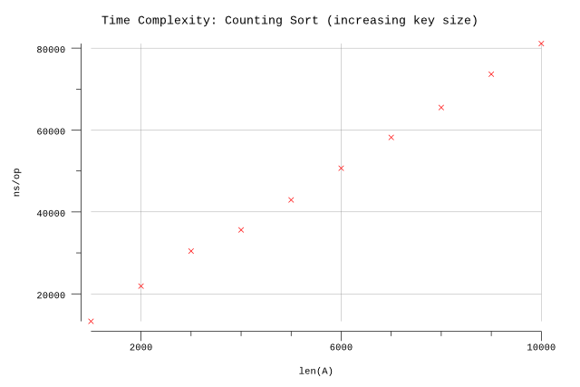

# Counting Sort

## Pseudocode

**Procedure:** `CountingSort(A, n, m)`

**Inputs:**

* `A`: an array of integers in the range `0` to `m - 1`.
* `n`: the number of elements in `A`.
* `m`: defines the range of the values in `A`.

**Output:** An array `B` containing the elements of `A`, sorted.

**Implementation:**

1. Call `CountKeysEqual(A, n, m)`, and assign its result to `equal`.
2. Call `CountKeysLess(equal, m)`, and assign its result to `less`.
3. Call `Rearrange(A, less, n, m)` and assign its result to `B`.
4. Return the `B` array.

**Procedure:** `CountKeysEqual(A, n, m)`

**Inputs:**

* `A`: an array of integers in the range `0` to `m - 1`.
* `n`: the number of elements in `A`.
* `m`: defines the range of the values in `A`.

**Output:** An array `equal[0..m-1]` such that `equal[j]` contains the number of elements of `A` that equal `j`, for `j = 0`, `1`, `2`,..., `m - 1`.

**Implementation:**

1. Let `equal[0..m-1]` be a new array.
2. Set all the values in `equal` to 0.
3. For `i = 1` to `n`:
   1. Set `key` to `A[i]`.
   2. Increment `equal[key]`.
4. Return the `equal` array.

**Procedure:** `CountKeysLess(equal, m)`

**Inputs:**

* `equal`: the array returned by `CountKeysEqual(A, n, m)`.
* `m`: defines the index range of `equal`: `0` to `m - 1`.

**Output:** An array `less[0..m-1]` such that for `j = 0`, `1`, `2`,..., `m - 1`, `less[j]` contains the sum `equal[0] + equal[1] + ...equal[j-1]`.

**Implementation:**

1. Let `less[0..m-1]` be a new array.
2. Set `less[0]` to `0`.
3. For `j = 1` to `m - 1`:
   1. Set `less[j]` to `less[j-1] + equal[j-1]`.
4. Return the `less` array.

**Procedure:** `Rearrange(A, less, n, m)`

**Inputs:**

* `A`: an array of integers in the range `0` to `m - 1`.
* `less`: the array returned by `CountKeysLess(equal, m)`.
* `n`: the number of elements in `A`.
* `m`: defines the range of the values in `A`.

**Output:** An array `B` containing the elements of `A`, sorted.

**Implementation:**

1. Let `B[1..n]` and `next[0..m-1]` be new arrays.
2. For `j = 0` to `m - 1`:
   1. Set `next[j]` to `less[j] + 1`.
3. For `i = 1` to `n`:
   1. Set `key` to `A[i]`.
   2. Set `index` to `next[key]`.
   3. Set `B[index]` to `A[i]`.
   4. Increment `next[key]`.
4. Return the `B` array.

## Implementation

* Arrays are zero indexed in Go so we adjust the loop accordingly.
* We infer `n` based on the length of `A`.

## Results

**Benchmark:**

```plain
$ go test -run=X -bench=Array -benchmem
goos: darwin
goarch: amd64
pkg: github.com/billglover/au/algorithms/counting-sort
BenchmarkCountingSortArraySize/_1000-4            300000              4899 ns/op            8432 B/op          4 allocs/op
BenchmarkCountingSortArraySize/_2000-4            200000             10155 ns/op           16624 B/op          4 allocs/op
BenchmarkCountingSortArraySize/_3000-4            100000             15563 ns/op           24816 B/op          4 allocs/op
BenchmarkCountingSortArraySize/_4000-4            100000             20004 ns/op           33008 B/op          4 allocs/op
BenchmarkCountingSortArraySize/_5000-4             50000             26599 ns/op           41200 B/op          4 allocs/op
BenchmarkCountingSortArraySize/_6000-4             50000             31255 ns/op           49392 B/op          4 allocs/op
BenchmarkCountingSortArraySize/_7000-4             30000             36999 ns/op           57584 B/op          4 allocs/op
BenchmarkCountingSortArraySize/_8000-4             30000             41859 ns/op           65776 B/op          4 allocs/op
BenchmarkCountingSortArraySize/_9000-4             30000             47311 ns/op           73968 B/op          4 allocs/op
BenchmarkCountingSortArraySize/_10000-4            30000             53576 ns/op           82160 B/op          4 allocs/op
PASS
ok      github.com/billglover/au/algorithms/counting-sort       18.573s
```

**Complexity:**

| Bounds | Complexity |
|--------|------------|
| Worst  | Θ(n)       |
| Best   | Θ(n)       |
| All    | Θ(n)       |




