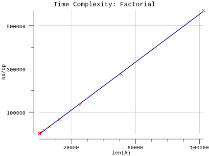

# Factorial

## Pseudocode

**Procedure:** `Factorial(n)`

**Input:** An integer `n >= 0`.

**Output:** The value of `n!`.

**Implementation:**

1. If n=0, then return 1 as the output.
2. Otherwise, return `n` times the value returned by recursively calling `Factorial(n - 1)`.

## Results

**Benchmark:**

```plain
$ go test -run=X -bench=Factorial -benchmem
goos: darwin
goarch: amd64
pkg: github.com/billglover/au/algorithms/factorial
BenchmarkFactorial_100-4         3000000               490 ns/op               0 B/op          0 allocs/op
BenchmarkFactorial_200-4         1000000              1008 ns/op               0 B/op          0 allocs/op
BenchmarkFactorial_400-4         1000000              1999 ns/op               0 B/op          0 allocs/op
BenchmarkFactorial_800-4          300000              4035 ns/op               0 B/op          0 allocs/op
BenchmarkFactorial_1600-4         200000              8132 ns/op               0 B/op          0 allocs/op
BenchmarkFactorial_3200-4         100000             16295 ns/op               0 B/op          0 allocs/op
BenchmarkFactorial_6400-4          50000             32601 ns/op               0 B/op          0 allocs/op
BenchmarkFactorial_12800-4         20000             66781 ns/op               0 B/op          0 allocs/op
BenchmarkFactorial_25600-4         10000            134488 ns/op               0 B/op          0 allocs/op
BenchmarkFactorial_51200-4          5000            274099 ns/op               0 B/op          0 allocs/op
BenchmarkFactorial_102400-4         2000            571501 ns/op               0 B/op          0 allocs/op
PASS
ok      github.com/billglover/au/algorithms/factorial   18.649s
```

**Complexity:**

| Bounds | Complexity |
|--------|------------|
| All    | Θ(n)       |


