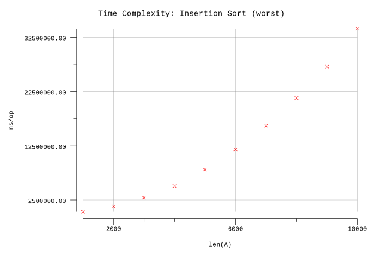
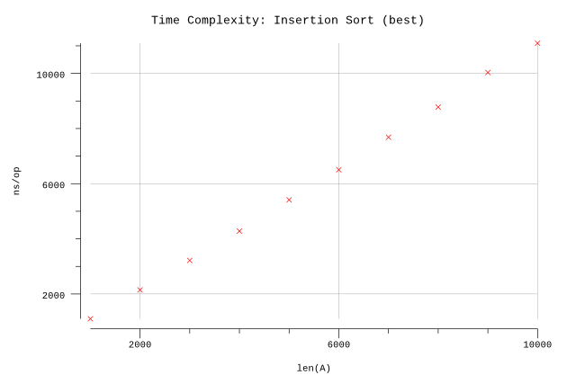
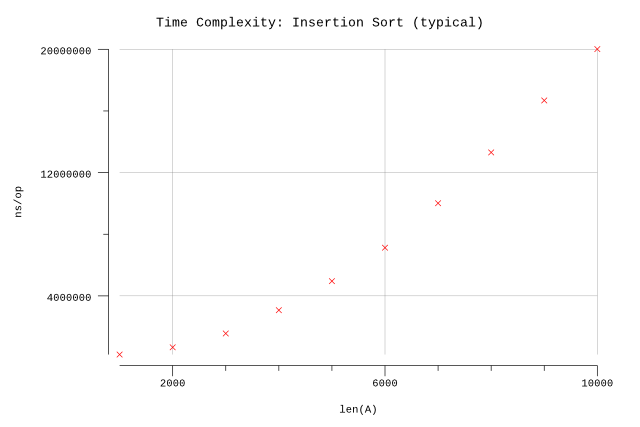

# Insertion Sort

## Pseudocode

**Procedure:** `InsertionSort(A, n)`

**Inputs:**

* `A`: an array
* `n`: the number of elements in `A` to sort

**Result:** The elements of `A` are sorted into non-decreasing order.

**Implementation:**

1. For `i = 2` to `n`:
   1. Set `key` to `A[i]`, and set `j` to `i - 1`.
   2. While `j < 0` and `A[j] >  key`, do the following:
      1. Set `A[j + 1]` to `A[j]`.
      2. Decrement `j` (i.e., set `j` to `j - 1`).
   3. Set `A[j + 1]` to `key`.

## Implementation

* Arrays are zero indexed in Go so we adjust the loop accordingly.
* We infer `n` based on the length of `A`.

## Results

**Benchmark:**

```plain
$ go test -run=X -bench=.
goos: darwin
goarch: amd64
pkg: github.com/billglover/au/algorithms/insertion-sort
BenchmarkInsertionSort_1000-4               3000            350248 ns/op
BenchmarkInsertionSort_2000-4               1000           1309712 ns/op
BenchmarkInsertionSort_3000-4                500           2921974 ns/op
BenchmarkInsertionSort_4000-4                300           5100202 ns/op
BenchmarkInsertionSort_5000-4                200           8098792 ns/op
BenchmarkInsertionSort_6000-4                100          11837795 ns/op
BenchmarkInsertionSort_7000-4                100          16208790 ns/op
BenchmarkInsertionSort_8000-4                 50          21319281 ns/op
BenchmarkInsertionSort_9000-4                 50          27082007 ns/op
BenchmarkInsertionSort_10000-4                50          34091940 ns/op
PASS
ok      github.com/billglover/au/algorithms/insertion-sort      16.160s
```

**Complexity:**

| Running Time | Complexity |
|--------------|------------|
| Worst        | Θ(n²)      |
| Best         | Θ(n)       |
| Typical      | Θ(n²)      |

The worse case represents an array that requires every element to be moved. For all `n` items in the array there are `n - 1` movements to be made. This results in a runtime of Θ(n²).



The best case represents an array that is already sorted. There are no movements to be made. This results in a runtime of Θ(n).



In the typical (random) case we can expect half the items to be sorted. For all `n` items in the array there are `n/2 - 1)` movements to be made. This results in a runtime of Θ(n²), although slightly faster than the worst case scenario.


