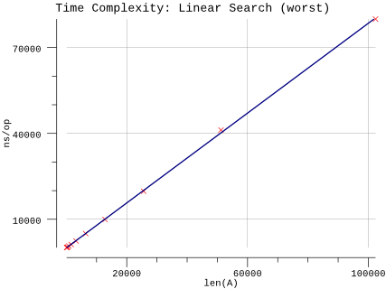
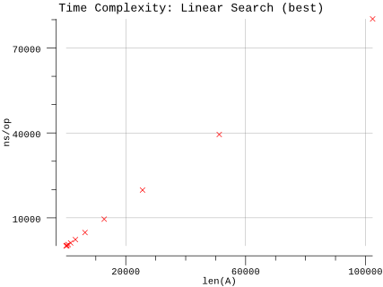
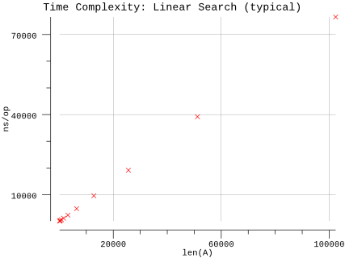

# Linear Search

## Pseudocode

**Procedure:** `LinearSearch(A, n, x)`

**Inputs:**

* `A`: an array
* `n`: the number of elements in A to search through
* `x`: the value being searched for

**Output:** Either an index `i` for which `A[i] = x`, or the special value `NOT-FOUND`, which could be any invalid index into the array, such as `0` or any negative integer.

**Implementation:**

1. Set `answer` to `NOT-FOUND`.
2. For each index `i`, going from `1` to `n`, in order:
   1. If `A[i] = x`, then set answer to the value of `i`.
3. Return the value of answer as the output.

## Implementation

* Instead of a magic number, we take advantage of Go's multiple return types and use a boolean to indicate whether the result was found.
* Arrays are zero indexed in Go so we adjust the loop accordingly.
* We infer `n` based on the length of `A`.

## Results

**Benchmark:**

```plain
$ go test -run=X -bench=Linear -benchmem
goos: darwin
goarch: amd64
pkg: github.com/billglover/au/algorithms/linear-search
BenchmarkLinearSearch_100-4             20000000                92.9 ns/op             0 B/op          0 allocs/op
BenchmarkLinearSearch_200-4             10000000               158 ns/op               0 B/op          0 allocs/op
BenchmarkLinearSearch_400-4              5000000               309 ns/op               0 B/op          0 allocs/op
BenchmarkLinearSearch_800-4              2000000               648 ns/op               0 B/op          0 allocs/op
BenchmarkLinearSearch_1600-4             1000000              1185 ns/op               0 B/op          0 allocs/op
BenchmarkLinearSearch_3200-4              500000              2434 ns/op               0 B/op          0 allocs/op
BenchmarkLinearSearch_6400-4              300000              5002 ns/op               0 B/op          0 allocs/op
BenchmarkLinearSearch_12800-4             200000              9951 ns/op               0 B/op          0 allocs/op
BenchmarkLinearSearch_25600-4             100000             19805 ns/op               0 B/op          0 allocs/op
BenchmarkLinearSearch_51200-4              30000             41167 ns/op               0 B/op          0 allocs/op
BenchmarkLinearSearch_102400-4             20000             79951 ns/op               0 B/op          0 allocs/op
PASS
ok      github.com/billglover/au/algorithms/linear-search       19.881s
```

**Complexity:**

| Bounds | Complexity |
|--------|------------|
| Upper  | O(n)       |
| Lower  | Ω(n)       |
| All    | Θ(n)       |

Worst case performance of the algorithm requires searching the full array. In this case we are searching for a value we know does not exist.



With this Linear Search algorithm the best case performance of the algorithm also requires searching through the full array.



The typical case matches both the best case and worst case performance.


