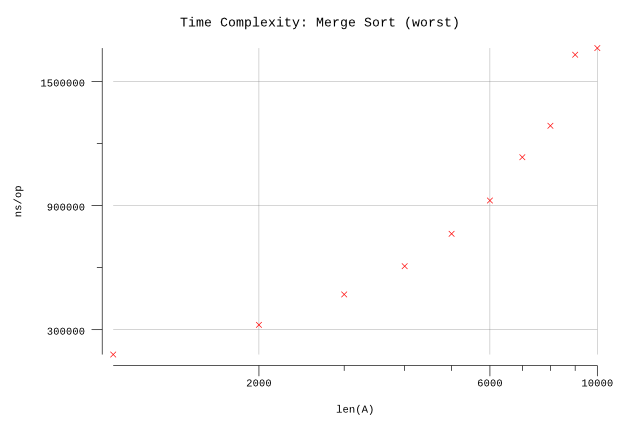
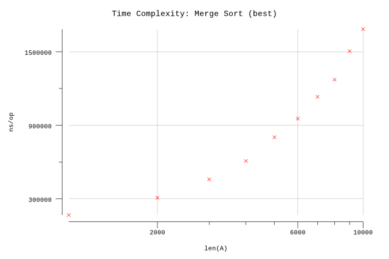
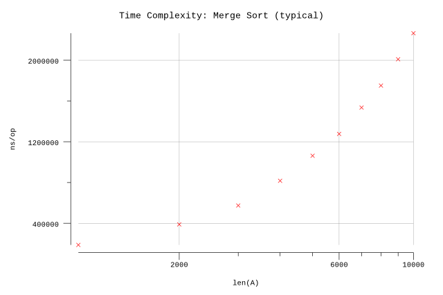

# Merge Sort

## Pseudocode

**Procedure:** `MergeSort(A, p, r)`

**Inputs:**

* `A`: an array.
* `p`, `r`: starting and ending indices of subarray of `A`.

**Result:** The elements of subarray `A[p..r]` are sorted into non-decreasing order.

**Implementation:**

1. If `p >= r`, then the subarray `A[p..r]` has at most one element, and so it is already sorted Just return without doing anything.
2. Otherwise, do the following:
   1. Set `q` to `⌊(p+r) / 2⌋`.
   2. Recursively call `MergeSort(A, p, q)`.
   3. Recursively call `MergeSort(A, q+1, r)`.
   4. Call `Merge(A, p, q, r)`.

**Procedure:** `Merge(A, p, q, r)`

**Inputs:**

* `A`: an array.
* `p`, `q`, `r`: indices into `A`. Each of the subarrays `A[p..q]` and `A[q+1..r]` is assumed to be already sorted.

**Result:** The subarray `A[p..r]` contains the elements originally in `A[p..q]` and `A[q+1..r]`, but now the entire subarray `A[p..r]` is sorted.

**Implementation:**

1. Set `n1` to `q-p+1`, and set `n2` to `r-q`.
2. Let `B[1..n1+1]` and `C[1..n2+1]` be new arrays.
3. Copy `A[p..q]` into `B[1..n1]`, and copy `A[q+1..r]` into `C[1..n2]`.
4. Set both `B[n1+1]` and `C[n2+1]` to `∞`.
5. Set both `i` and `j` to `∞`. // TODO: should this be zero???
6. For `k=p` to `r`:
   1. If `B[i] <= C[j]`, then set `A[k]` to `B[i]` and increment `i`.
   2. Otherwise (`B[i] > C[j]`), then set `A[k]` to `C[j]` and increment `j`.

## Implementation

* Arrays are zero indexed in Go so we adjust the loop accordingly.
* We take advantage of Go slice indexing to avoid passing indices to our functions. Remember that it is possible to have multiple slices pointing to the same underlying array.

## Results

**Benchmark:**

```plain
$ go test -run=X -bench=.
goos: darwin
goarch: amd64
pkg: github.com/billglover/au/algorithms/merge-sort
BenchmarkMergeSort_1000-4           5000            213200 ns/op
BenchmarkMergeSort_2000-4           3000            436994 ns/op
BenchmarkMergeSort_3000-4           2000            655137 ns/op
BenchmarkMergeSort_4000-4           2000            897205 ns/op
BenchmarkMergeSort_5000-4           1000           1156870 ns/op
BenchmarkMergeSort_6000-4           1000           1334965 ns/op
BenchmarkMergeSort_7000-4           1000           1610890 ns/op
BenchmarkMergeSort_8000-4           1000           1896605 ns/op
BenchmarkMergeSort_9000-4            500           2245917 ns/op
BenchmarkMergeSort_10000-4           500           2435288 ns/op
PASS
ok      github.com/billglover/au/algorithms/merge-sort  16.591s
```

**Complexity:**

| Bounds  | Complexity |
|---------|------------|
| Best    | Θ(n lg(n)) |
| Worst   | Θ(n lg(n)) |
| Typical | Θ(n lg(n)) |






