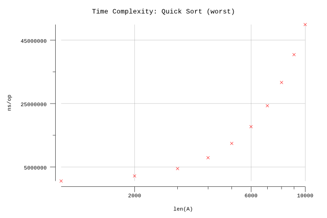
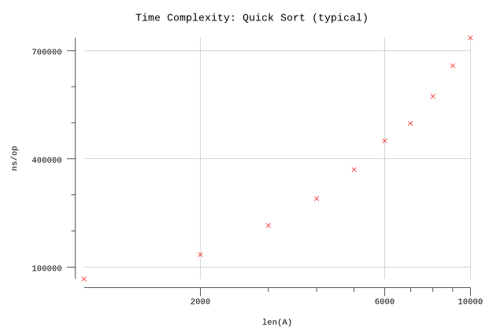

# Quicksort

## Pseudocode

**Procedure:** `Quicksort(A, p, r)`

**Inputs:**

* `A`: an array.
* `p`, `r`: starting and ending indices of subarray of `A`.

**Result:** The elements of subarray `A[p..r]` are sorted into non-decreasing order.

**Implementation:**

1. If `p >= r`, then just return without doing anything.
2. Otherwise, do the following:
   1. Call `Partition(A, p, r)`, and set `q` to its result.
   2. Recursively call `Quicksort(A, p, q-1)`.
   3. Recursively call `Quicksort(A, q+1, r)`.

**Procedure:** `Partition(A, p, r)`

**Inputs:**

* `A`: an array.
* `p`, `r`: starting and ending indices of subarray of `A`.

**Result:** Rearranges the elements of `A[p..r]` so that every element in `A[p..q-1]` is less than or equal to `A[q]` and every element in `A[q+1..r]` is greater than `A[q]`. Returns the index `q` to the caller.

**Implementation:**

1. Set `q` to `p`.
2. For `u = p` to `r - 1` do:
   1. If `A[u] <= A[r]`, then swap `A[q]` with `A[u]` and increment `q`.
3. Swap `A[q]` with `A[r]` and then return `q`.

## Implementation

* Arrays are zero indexed in Go so we adjust the loop accordingly.
* We randomly select our pivot point. Although not outlined in the pseudocode, this step is outlined later in the text describing the algorithm.

## Results

**Benchmark:**

```plain
$ go test -run=X -bench=. | plotbench -title="Time Complexity: Quick Sort (worst)" -width=480 -height=320 -logX
goos: darwin
goarch: amd64
pkg: github.com/billglover/au/algorithms/quicksort
BenchmarkQuickSort/ArraySize_1000-4                 2000            570111 ns/op
BenchmarkQuickSort/ArraySize_2000-4                 1000           2159871 ns/op
BenchmarkQuickSort/ArraySize_3000-4                  300           4484267 ns/op
BenchmarkQuickSort/ArraySize_4000-4                  200           7921741 ns/op
BenchmarkQuickSort/ArraySize_5000-4                  100          12432102 ns/op
BenchmarkQuickSort/ArraySize_6000-4                  100          17708309 ns/op
BenchmarkQuickSort/ArraySize_7000-4                   50          24326144 ns/op
BenchmarkQuickSort/ArraySize_8000-4                   50          31669510 ns/op
BenchmarkQuickSort/ArraySize_9000-4                   30          40448853 ns/op
BenchmarkQuickSort/ArraySize_10000-4                  30          49947091 ns/op
PASS
ok      github.com/billglover/au/algorithms/quicksort   19.656s
```

**Complexity:**

| Bounds  | Complexity |
|---------|------------|
| Best    | Θ(n lg(n)) |
| Worst   | Θ(n²)      |
| Typical | Θ(n lg(n)) |





Note that the worst case running time occurs when the input array, `A`, is sorted either in correct or reverse order. This happens because the choice of pivot results in an uneven split, driving up the number of iterations required to recursively cover the array.