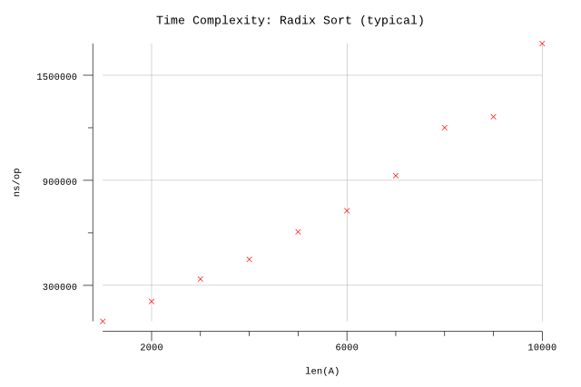

# Radix Sort

## Pseudocode

The pseudocode for Radix Sort is not provided in the book. The version shown here is not the most efficient implementation but attempts to stay true to the algorithm described in the text to demonstrate how Counting Sort is the foundation for Radix Sort.

**Procedure:** `RadixSort(A, m)`

**Inputs:**

* `A`: an array of strings of length `m`.
* `m`: defines the length of the values in `A`.

**Output:** An array `B` containing the elements of `A`, sorted.

**Implementation:**

We use a modified version of `CountingSort(A)` that allows us to indicate which character position in the key we would like to sort on. We then call this starting with the right-most character until we end up sorting based on the first character in the key. The result is our sorted array.

1. Copy `A` to `B`.
2. For `c = m-1` to `0`:
   1. Set `B` to  `CountingSort(B, c)`.
3. Return `B`.

**Procedure:** `CountingSort(A, c)`

**Inputs:**

* `A`: an array of strings of length `m`.
* `c`: The character position to sort by, where `c>=0 && c<m`.

**Output:** An array `B` containing the elements of `A`, sorted.

**Implementation:**

1. Let `equal[0..35]` be a new array.
2. For `i = 0` to `len(A)`:
   1. Set `key` to `A[i][c]`.
   2. Increment `equal[key]`.
3. Let `less[0..35]` be a new array.
4. For `i = 1` to `len(A)`:
   1. Set `less[i]` to `less[i-1] + equal[i-1]`.
5. Let `B[0..len(A)]` and `next[0..35]` be new arrays.
6. Copy `less[]` to `next[]`.
7. For `i = 0` to `len(A)`:
   1. Set `key` to `A[i]`.
   2. Set `index` to `next[key]`.
   3. Set `B[index]` to `A[i]`.
   4. Increment `next[key]`.
8. Return the `B` array.

## Implementation

* We compress the range of the keys used in counting sort such that:
  * The digits `0..9` map directly onto `0..9`.
  * The letters `A..Z` map onto `10..35`.

## Results

**Benchmark:**

```plain
$ go test -run=X -bench=. -benchmem
goos: darwin
goarch: amd64
pkg: github.com/billglover/au/algorithms/radix-sort
BenchmarkRadixSort/_1000-4                 20000             94833 ns/op          114688 B/op          7 allocs/op
BenchmarkRadixSort/_2000-4                  5000            208463 ns/op          229376 B/op          7 allocs/op
BenchmarkRadixSort/_3000-4                  3000            336241 ns/op          344064 B/op          7 allocs/op
BenchmarkRadixSort/_4000-4                  3000            448348 ns/op          458752 B/op          7 allocs/op
BenchmarkRadixSort/_5000-4                  2000            605747 ns/op          573440 B/op          7 allocs/op
BenchmarkRadixSort/_6000-4                  2000            726369 ns/op          688128 B/op          7 allocs/op
BenchmarkRadixSort/_7000-4                  2000            926982 ns/op          802816 B/op          7 allocs/op
BenchmarkRadixSort/_8000-4                  1000           1200584 ns/op          917504 B/op          7 allocs/op
BenchmarkRadixSort/_9000-4                  1000           1262949 ns/op         1032192 B/op          7 allocs/op
BenchmarkRadixSort/_10000-4                 1000           1680725 ns/op         1146880 B/op          7 allocs/op
PASS
ok      github.com/billglover/au/algorithms/radix-sort  15.858s
```

**Complexity:**

| Bounds | Complexity |
|--------|------------|
| Worst  | Θ(n)       |
| Best   | Θ(n)       |
| All    | Θ(n)       |


