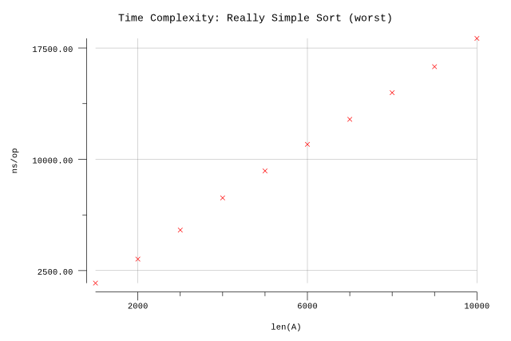
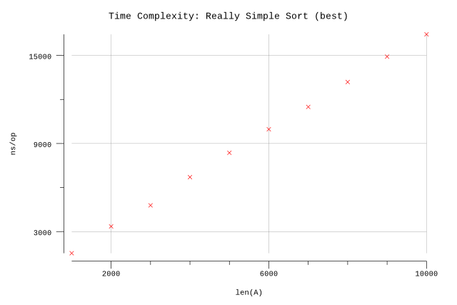

# Really Simple Sort

## Pseudocode

**Procedure:** `ReallySimpleSort(A, n)`

**Inputs:**

* `A`: an array in which each element is either 1 or 2.
* `n`: the number of elements in A to sort.

**Output:** The elements of A are sorted into non-descending order.

**Implementation:**

1. Set `k` to `0`.
2. For `i = 1` to `n`:
   1. If `A[i] == 1`, then increment `k`.
3. For `i = 1` to `k`:
   1. Set `A[i]` to `1`
4. For `i = k + 1` to `n`:
   1. Set `A[i]` to `2`

## Implementation

* Arrays are zero indexed in Go so we adjust the loop accordingly.
* We infer `n` based on the length of `A`.
* We use slices instead of arrays.

## Results

**Benchmarks:**

```plain
$ go test -run=X -bench=.
goos: darwin
goarch: amd64
pkg: github.com/billglover/au/algorithms/really-simple-sort
BenchmarkReallySimpleSort/ArraySize_1000-4               1000000              1657 ns/op
BenchmarkReallySimpleSort/ArraySize_2000-4                500000              3274 ns/op
BenchmarkReallySimpleSort/ArraySize_3000-4                300000              5232 ns/op
BenchmarkReallySimpleSort/ArraySize_4000-4                200000              7401 ns/op
BenchmarkReallySimpleSort/ArraySize_5000-4                200000              9218 ns/op
BenchmarkReallySimpleSort/ArraySize_6000-4                200000             11007 ns/op
BenchmarkReallySimpleSort/ArraySize_7000-4                100000             12691 ns/op
BenchmarkReallySimpleSort/ArraySize_8000-4                100000             14487 ns/op
BenchmarkReallySimpleSort/ArraySize_9000-4                100000             16239 ns/op
BenchmarkReallySimpleSort/ArraySize_10000-4               100000             18145 ns/op
PASS
ok      github.com/billglover/au/algorithms/really-simple-sort  17.638s
```

**Complexity:**

| Running Time | Complexity |
|--------------|------------|
| Worst        | Θ(n)       |
| Best         | Θ(n)       |
| Typical      | Θ(n)       |






