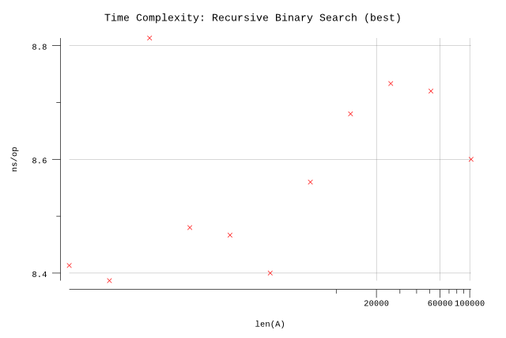

# Linear Search

## Pseudocode

**Procedure:** `RecursiveBinarySearch(A, p, r, x)`

**Inputs:**

* `A`: an array
* `p`: delineates the lower bound of the subarray `A[p..r]` under consideration
* `r`: delineates the upper bound of the subarray `A[p..r]` under consideration
* `x`: the value being searched for

**Output:** Either an index `i` for which `A[i] = x`, or the special value `NOT-FOUND`, which could be any invalid index into the array, such as `0` or any negative integer.

**Implementation:**

1. If `p > r`, then return `NOT-FOUND`.
2. Otherwise `p <= r`, do the following:
   1. Set `q` to `⌊(p+r) / 2⌋`.
   2. If `A[q] == x` then return `q`.
   3. Otherwise (`A[q] != x`), if `A[q] > x`, then return `RecursiveBinarySearch(A, p, q-1, x)`.
   4. Otherwise (`A[q] < x`), then return `RecursiveBinarySearch(A, q+1, r, x)`.

## Implementation

* Instead of a magic number, we take advantage of Go's multiple return types and use a boolean to indicate whether the result was found.
* Arrays are zero indexed in Go so we adjust the loop accordingly.
* We infer `n` based on the length of `A`.

## Results

**Benchmark:**

```plain
$ go test -run=X -bench=. -benchmem
goos: darwin
goarch: amd64
pkg: github.com/billglover/au/algorithms/recursive-binary-search
BenchmarkRecursiveBinarySearch_100-4            30000000                38.0 ns/op             0 B/op          0 allocs/op
BenchmarkRecursiveBinarySearch_200-4            30000000                43.9 ns/op             0 B/op          0 allocs/op
BenchmarkRecursiveBinarySearch_400-4            30000000                48.7 ns/op             0 B/op          0 allocs/op
BenchmarkRecursiveBinarySearch_800-4            20000000                53.3 ns/op             0 B/op          0 allocs/op
BenchmarkRecursiveBinarySearch_1600-4           20000000                60.7 ns/op             0 B/op          0 allocs/op
BenchmarkRecursiveBinarySearch_3200-4           20000000                68.7 ns/op             0 B/op          0 allocs/op
BenchmarkRecursiveBinarySearch_6400-4           20000000                76.3 ns/op             0 B/op          0 allocs/op
BenchmarkRecursiveBinarySearch_12800-4          20000000                80.1 ns/op             0 B/op          0 allocs/op
BenchmarkRecursiveBinarySearch_25600-4          20000000                95.0 ns/op             0 B/op          0 allocs/op
BenchmarkRecursiveBinarySearch_51200-4          20000000               101 ns/op               0 B/op          0 allocs/op
BenchmarkRecursiveBinarySearch_102400-4         20000000               107 ns/op               0 B/op          0 allocs/op
PASS
ok      github.com/billglover/au/algorithms/recursive-binary-search     17.916s
```

**Complexity:**

| Bounds | Complexity |
|--------|------------|
| Worst  | Θ(lg n)       |
| Best   | Θ(1)       |
| All    | O(n)       |

Worst case performance of the algorithm requires searching the full array, but we take advantage of the fact that the array is sorted to achieve Θ(ln n) in the time domain.


With the Binary Search algorithm the best case performance of the algorithm is when the item we are looking for is in the middle of the array.



The typical case lies between the best and worst case bounds.


