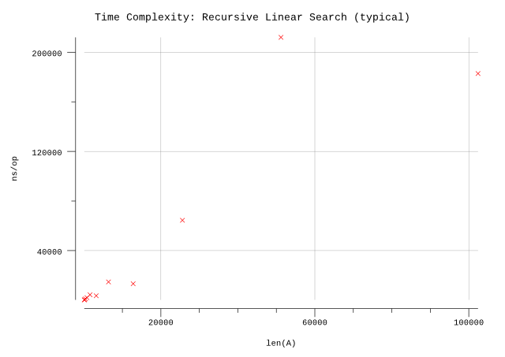

# Recursive Linear Search

## Pseudocode

**Procedure:** `RecursiveLinearSearch(A, n, l, x)`

**Inputs:**

* `A`: an array
* `n`: the number of elements in A to search through
* `i`: the index of the start of the sub-array
* `x`: the value being searched for

**Output:** The index of an element equaling `x` in the subarray from `A[i]` through `A[n]`, or `NOT-FOUND` if `x` does not appear in this subarray.

**Implementation:**

1. If `i > n` then return `NOT-FOUND`.
2. Otherwise (`i <= n`), if `A[i] = x`, then return `i`.
3. Otherwise (`i <= n` and `A[i] = x`), return `RecursiveLinearSearch(A, n, i+1, x)`.

## Implementation

* Instead of a magic number, we take advantage of Go's multiple return types and use a boolean to indicate whether the result was found.
* Arrays are zero indexed in Go so we adjust the indexes accordingly.
* We can used Go slices to avoid passing in the additional parameter. This is shown in `RecursiveLinearSearchAlt`.

## Results

**Benchmark:**

```plain
$ go test -run=X -bench=. -benchmemgoos: darwin
goarch: amd64
pkg: github.com/billglover/au/algorithms/recursive-linear-search
BenchmarkRecursiveLinearSearch_100-8             5000000               308 ns/op               0 B/op          0 allocs/op
BenchmarkRecursiveLinearSearch_200-8             2000000               606 ns/op               0 B/op          0 allocs/op
BenchmarkRecursiveLinearSearch_400-8             1000000              1210 ns/op               0 B/op          0 allocs/op
BenchmarkRecursiveLinearSearch_800-8              500000              2568 ns/op               0 B/op          0 allocs/op
BenchmarkRecursiveLinearSearch_1600-8             300000              5233 ns/op               0 B/op          0 allocs/op
BenchmarkRecursiveLinearSearch_3200-8             200000             10731 ns/op               0 B/op          0 allocs/op
BenchmarkRecursiveLinearSearch_6400-8              50000             24561 ns/op               0 B/op          0 allocs/op
BenchmarkRecursiveLinearSearch_12800-8             30000             50934 ns/op               0 B/op          0 allocs/op
BenchmarkRecursiveLinearSearch_25600-8             10000            104870 ns/op               0 B/op          0 allocs/op
BenchmarkRecursiveLinearSearch_51200-8              5000            218632 ns/op               0 B/op          0 allocs/op
BenchmarkRecursiveLinearSearch_102400-8             2000            692215 ns/op               0 B/op          0 allocs/op
PASS
ok      github.com/billglover/au/algorithms/recursive-linear-search     17.354s
```

**Complexity:**

| Bounds | Complexity |
|--------|------------|
| Upper  | O(n)       |
| Lower  | Ω(n)       |
| All    | Θ(n)       |

Worst case performance of the algorithm requires searching the full array. In this case we are searching for a value we know does not exist.


With this Linear Search algorithm the best case performance of the algorithm also requires searching through the full array.


The typical case matches both the best case and worst case performance.


