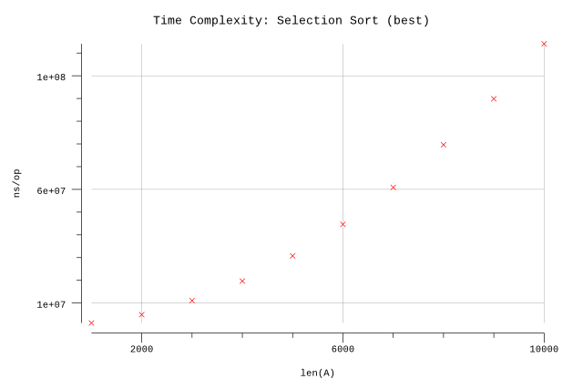
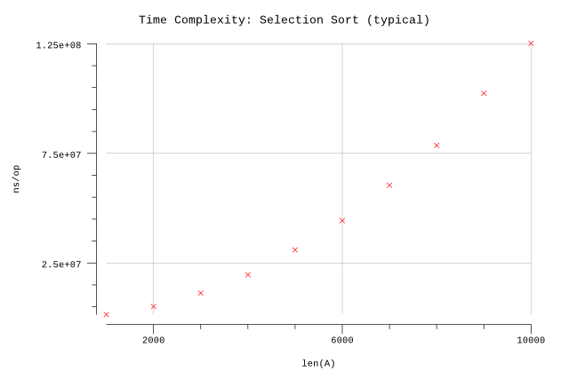

# Selection Sort

## Pseudocode

**Procedure:** `SelectionSort(A, n)`

**Inputs:**

* `A`: an array
* `n`: the number of elements in `A` to sort

**Result:** The elements of `A` are sorted into non-decreasing order.

**Implementation:**

1. For `i = 1` to `n-1`:
   1. Set `smallest` to `i`.
   2. For `j = i+1` to `n`:
      1. If `A[j] < A[smallest]` then set `smallest` to `j`.
   3. Swap `A[i]` with `A[smallest]`.

## Implementation

* Arrays are zero indexed in Go so we adjust the loop accordingly.
* We infer `n` based on the length of `A`.

## Results

**Benchmark:**

```plain
$ go test -run=X -bench=SelectionSort -benchmem | plotbench -title="Time Complexity: Selection Sort" -width=480 -height=320goos: darwin
goarch: amd64
pkg: github.com/billglover/au/algorithms/selection-sort
BenchmarkSelectionSort_1000-4               1000           1247913 ns/op               0 B/op          0 allocs/op
BenchmarkSelectionSort_2000-4                300           5106675 ns/op               0 B/op          0 allocs/op
BenchmarkSelectionSort_3000-4                100          11368077 ns/op               0 B/op          0 allocs/op
BenchmarkSelectionSort_4000-4                100          19663506 ns/op               0 B/op          0 allocs/op
BenchmarkSelectionSort_5000-4                 50          30569167 ns/op               0 B/op          0 allocs/op
BenchmarkSelectionSort_6000-4                 30          44104133 ns/op               0 B/op          0 allocs/op
BenchmarkSelectionSort_7000-4                 20          60009467 ns/op               0 B/op          0 allocs/op
BenchmarkSelectionSort_8000-4                 20          78402906 ns/op               0 B/op          0 allocs/op
BenchmarkSelectionSort_9000-4                 20          99263290 ns/op               0 B/op          0 allocs/op
BenchmarkSelectionSort_10000-4                10         122261060 ns/op               0 B/op          0 allocs/op
PASS
ok      github.com/billglover/au/algorithms/selection-sort      16.865s
```

**Complexity:**

| Bounds  | Complexity |
|---------|------------|
| Best    | Θ(n²)      |
| Worst   | Θ(n²)      |
| Typical | Θ(n²)      |

The best case represents an array that is already sorted. The worse case represents an array that requires every element to be moved. In all cases the number of loops we perform through the array `A` is the same and so we can say the running time is Θ(n²).





