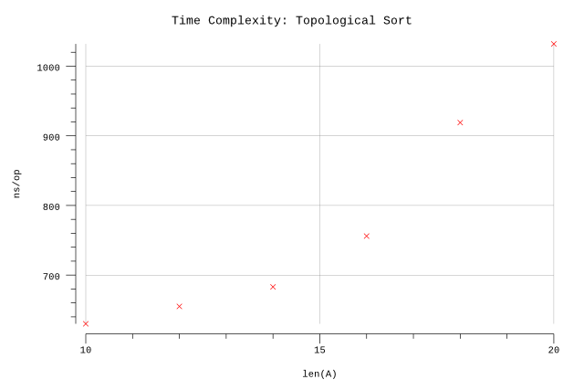

# Topological Sort

## Pseudocode

**Procedure:** `CountingSort(A, n, m)`

**Input:** `G`: a directed acyclic graph with vertices numbered `0` to `n`.

**Output:** A linear order of the vertices such that `u` appears before `v` in the linear order if `(u, v)` is an edge in the graph.

**Implementation:**

1. Let `inDegree[0::n]` be a new array, and create an empty linear order of vertices.
2. Set all values in `inDegree` to `0`.
3. For each vertex `u`:
   1. For each vertex `v` adjacent to `u`:
      1. Increment `inDegree[v]`.
4. Make a list `next` consisting of all vertices `u` such that `inDegree[u] = 0`.
5. While `next` is not empty, do the following:
   1. Delete a vertex from `next`, and call it vertex `u`.
   2. Add `u` to the end of the linear order.
   3. For each vertex `v` adjacent to `u`:
      1. Decrement `inDegree[v]`.
      2. If `inDegree[v] = 0`, then insert `v` into the `next` list.
6. Return the linear order.

## Implementation Notes

* Benchmarking could consider variation in two dimentions:
  * Increasing number of vertices
  * Increasing number of edges

## Results

**Benchmark:**

The benchmark results show how the running time of the Topological Sort algorithm varies with increasing node count.

```plain
$ go test -run=X -bench=. -benchmem
goos: darwin
goarch: amd64
pkg: github.com/billglover/au/algorithms/topological-sort
BenchmarkTopologicalSort/_10-4           2000000               630 ns/op             480 B/op         12 allocs/op
BenchmarkTopologicalSort/_12-4           2000000               655 ns/op             560 B/op         13 allocs/op
BenchmarkTopologicalSort/_14-4           2000000               683 ns/op             608 B/op         13 allocs/op
BenchmarkTopologicalSort/_16-4           2000000               756 ns/op             640 B/op         14 allocs/op
BenchmarkTopologicalSort/_18-4           2000000               919 ns/op             944 B/op         15 allocs/op
BenchmarkTopologicalSort/_20-4           1000000              1032 ns/op             992 B/op         15 allocs/op
PASS
ok      github.com/billglover/au/algorithms/topological-sort    12.067s
```

**Complexity:**


