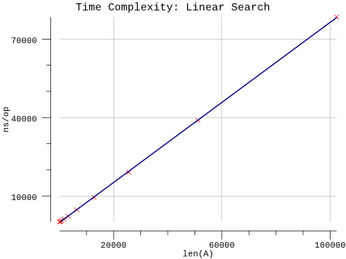

# Linear Search

## Pseudocode

**Procedure:** `LinearSearch(A, n, x)`

**Inputs:**

* `A`: an array
* `n`: the number of elements in A to search through
* `x`: the value being searched for

**Output:** Either an index `i` for which `A[i] = x`, or the special value `NOT-FOUND`, which could be any invalid index into the array, such as `0` or any negative integer.

**Implementation:**

1. Set `answer` to `NOT-FOUND`.
2. For each index `i`, going from `1` to `n`, in order:
   1. If `A[i] = x`, then set answer to the value of `i`.
3. Return the value of answer as the output.

## Implementation

* Instead of a magic number, we take advantage of Go's multiple return types and use a boolean to indicate whether the result was found.
* Arrays are zero indexed in Go so we adjust the loop accordingly.
* We infer `n` based on the length of `A`.

## Results

**Benchmark:**

```plain
$ go test -run=X -bench=Linear -benchmem
goos: darwin
goarch: amd64
pkg: github.com/billglover/au/linear-search
BenchmarkLinearSearch_100-4             20000000                84.1 ns/op             0 B/op          0 allocs/op
BenchmarkLinearSearch_200-4             10000000               153 ns/op               0 B/op          0 allocs/op
BenchmarkLinearSearch_400-4              5000000               294 ns/op               0 B/op          0 allocs/op
BenchmarkLinearSearch_800-4              3000000               581 ns/op               0 B/op          0 allocs/op
BenchmarkLinearSearch_1600-4             1000000              1164 ns/op               0 B/op          0 allocs/op
BenchmarkLinearSearch_3200-4              500000              2284 ns/op               0 B/op          0 allocs/op
BenchmarkLinearSearch_6400-4              300000              4723 ns/op               0 B/op          0 allocs/op
BenchmarkLinearSearch_12800-4             200000              9518 ns/op               0 B/op          0 allocs/op
BenchmarkLinearSearch_25600-4             100000             19099 ns/op               0 B/op          0 allocs/op
BenchmarkLinearSearch_51200-4              30000             38917 ns/op               0 B/op          0 allocs/op
BenchmarkLinearSearch_102400-4             20000             78433 ns/op               0 B/op          0 allocs/op
PASS
ok      github.com/billglover/au/linear-search  19.560s
```

**Complexity:**


